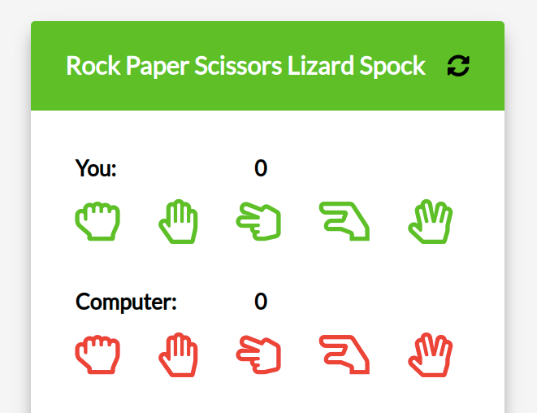

# basicJS_Spock Rock Game: [LIVE DEMO](https://shcoobz.github.io/basicJS_spock-rock-game/)

## Summary

Spock Rock Game brings a fun and interactive twist to the classic Rock Paper Scissors game by incorporating two additional elements: Lizard and Spock. It features a simple, user-friendly interface, enabling players to easily select their move and instantly see the outcome of the match against the computer.

The core functionality includes:

- Player vs. Computer gameplay
- Real-time result display showing the winner of each round
- Score tracking for both player and computer
- A reset feature to start a new game at any time

## Features

### Easy to Play

The game has been designed with simplicity in mind, making it easy for players of all ages to understand and engage with.

### Real-Time Results

As soon as a choice is made, the game calculates and displays the outcome, updating the score accordingly.

### Score Tracking

Keeps track of the player's and computer's scores throughout the game session, adding a competitive edge to the game.

### Responsive Design

The game is fully responsive, ensuring a seamless experience on both desktop and mobile devices.

## Technologies

- HTML: Structure of the game interface.
- CSS: Styling for the game, ensuring a visually appealing and responsive design.
- JavaScript: Powers the game's logic, including player input handling, computer choice generation, and determining the winner of each round.
- [Confetti.js](https://www.cssscript.com/css-css3/): A third-party library used to create a confetti animation effect when the player wins a round.

---

_Note: This document provides an overview of Spock Rock Game. For detailed instructions and more information, please refer to the source code documentation._
